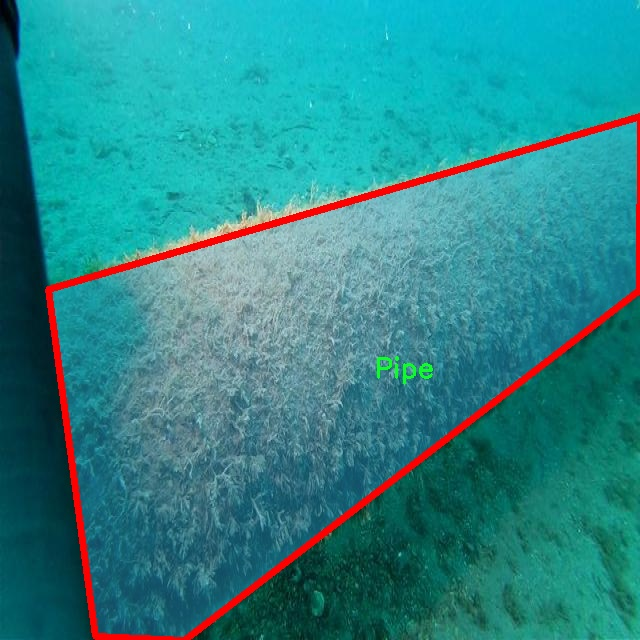

### 1.背景意义

研究背景与意义

随着全球经济的快速发展，水下基础设施的建设与维护变得愈发重要。水下管道作为重要的能源和物资运输通道，其安全性直接关系到环境保护和经济稳定。然而，水下管道由于长期处于复杂的水下环境中，容易受到腐蚀、泄漏等问题的影响，导致环境污染和资源浪费。因此，开发高效的水下管道巡检技术，及时发现并处理潜在的泄漏问题，显得尤为重要。

传统的水下管道巡检方法多依赖人工检查或简单的监测设备，这不仅效率低下，而且容易漏检。近年来，计算机视觉技术的快速发展为水下管道的自动化巡检提供了新的解决方案。基于深度学习的图像分割技术，尤其是YOLO（You Only Look Once）系列模型，因其在实时目标检测和分割任务中的优越性能，成为研究的热点。YOLOv11作为该系列的最新版本，结合了更高的检测精度和更快的处理速度，适合在复杂的水下环境中进行实时监测。

本研究旨在基于改进的YOLOv11模型，构建一个高效的水下管道巡检泄漏检测图像分割系统。通过利用包含1000幅图像的水下管道数据集，该系统能够对水下管道的各类特征进行精准识别与分割，包括混凝土垫、混凝土重物、泄漏、管道及管道连接件等五个类别。通过对这些类别的细致分析与处理，系统不仅能够实现对泄漏问题的及时发现，还能为后续的维护决策提供科学依据。

综上所述，本研究不仅具有重要的理论意义，还将为水下管道的安全监测提供切实可行的技术支持，推动水下基础设施的智能化发展。

### 2.视频效果

[2.1 视频效果](https://www.bilibili.com/video/BV1bnk9Y7ESj/)

### 3.图片效果


##### [项目涉及的源码数据来源链接](https://kdocs.cn/l/cszuIiCKVNis)**

注意：本项目提供训练的数据集和训练教程,由于版本持续更新,暂不提供权重文件（best.pt）,请按照6.训练教程进行训练后实现上图演示的效果。

### 4.数据集信息

##### 4.1 本项目数据集类别数＆类别名

nc: 5
names: ['Concrete Mat', 'Concrete weight', 'Leakage', 'Pipe', 'Pipe coupling']


该项目为【图像分割】数据集，请在【训练教程和Web端加载模型教程（第三步）】这一步的时候按照【图像分割】部分的教程来训练

##### 4.2 本项目数据集信息介绍

本项目数据集信息介绍

本项目所使用的数据集专注于水下管道的巡检与泄露检测，旨在为改进YOLOv11的图像分割系统提供强有力的支持。数据集包含五个主要类别，分别为“混凝土垫”、“混凝土重物”、“泄漏”、“管道”和“管道连接件”。这些类别的选择反映了水下管道环境中常见的元素，尤其是在进行管道巡检时，能够有效地帮助检测和识别潜在的泄漏问题。

在数据集的构建过程中，研究团队广泛收集了来自不同水域的图像，确保数据的多样性和代表性。这些图像涵盖了各种水下环境，包括清澈的湖泊、浑浊的河流以及海洋等，以模拟实际应用中可能遇到的不同情况。每个类别的图像均经过精心标注，确保在训练过程中能够提供准确的标签信息，从而提高模型的学习效果。

数据集不仅包含了静态图像，还包括了一些动态场景的捕捉，以便于模型在处理实际巡检任务时，能够适应不同的拍摄条件和环境变化。通过对“泄漏”这一类别的重点标注，数据集特别关注了水下管道可能出现的故障，力求为后续的算法优化提供丰富的训练样本。

总之，本项目的数据集为改进YOLOv11的水下管道巡检泄露检测图像分割系统奠定了坚实的基础，涵盖了多样的场景和类别，旨在提升模型的准确性和鲁棒性，以应对实际应用中的各种挑战。通过有效的训练和验证，期望能够在水下管道监测领域实现更高效的泄漏检测与管理。





### 5.全套项目环境部署视频教程（零基础手把手教学）

[5.1 所需软件PyCharm和Anaconda安装教程（第一步）](https://www.bilibili.com/video/BV1BoC1YCEKi/?spm_id_from=333.999.0.0&vd_source=bc9aec86d164b67a7004b996143742dc)


[5.2 安装Python虚拟环境创建和依赖库安装视频教程（第二步）](https://www.bilibili.com/video/BV1ZoC1YCEBw?spm_id_from=333.788.videopod.sections&vd_source=bc9aec86d164b67a7004b996143742dc)

### 6.改进YOLOv11训练教程和Web_UI前端加载模型教程（零基础手把手教学）

[6.1 改进YOLOv11训练教程和Web_UI前端加载模型教程（第三步）](https://www.bilibili.com/video/BV1BoC1YCEhR?spm_id_from=333.788.videopod.sections&vd_source=bc9aec86d164b67a7004b996143742dc)


按照上面的训练视频教程链接加载项目提供的数据集，运行train.py即可开始训练



     Epoch   gpu_mem       box       obj       cls    labels  img_size
     1/200     20.8G   0.01576   0.01955  0.007536        22      1280: 100%|██████████| 849/849 [14:42<00:00,  1.04s/it]
               Class     Images     Labels          P          R     mAP@.5 mAP@.5:.95: 100%|██████████| 213/213 [01:14<00:00,  2.87it/s]
                 all       3395      17314      0.994      0.957      0.0957      0.0843

     Epoch   gpu_mem       box       obj       cls    labels  img_size
     2/200     20.8G   0.01578   0.01923  0.007006        22      1280: 100%|██████████| 849/849 [14:44<00:00,  1.04s/it]
               Class     Images     Labels          P          R     mAP@.5 mAP@.5:.95: 100%|██████████| 213/213 [01:12<00:00,  2.95it/s]
                 all       3395      17314      0.996      0.956      0.0957      0.0845

     Epoch   gpu_mem       box       obj       cls    labels  img_size
     3/200     20.8G   0.01561    0.0191  0.006895        27      1280: 100%|██████████| 849/849 [10:56<00:00,  1.29it/s]
               Class     Images     Labels          P          R     mAP@.5 mAP@.5:.95: 100%|███████   | 187/213 [00:52<00:00,  4.04it/s]
                 all       3395      17314      0.996      0.957      0.0957      0.0845


###### [项目数据集下载链接](https://kdocs.cn/l/cszuIiCKVNis)

### 7.原始YOLOv11算法讲解

YOLO11采用改进的骨干和颈部架构，增强了特征提取能力，提高了物体检测的精确度和复杂任务的表现。YOLO11引入精炼的架构设计和优化的训练流程，实现更快的处理速度，同时保持精度和性能之间的最佳平衡。通过模型设计的进步，YOLO11m在COCO数据集上实现了更高的均值平均精度（mAP），同时使用比YOLOv8m少22%的参数，使其在不妥协准确性的情况下更加计算高效。YOLO11可以无缝部署在各种环境中，包括边缘设备、云平台以及支持NVIDIA
GPU的系统，确保最大灵活性。无论是物体检测、实例分割、图像分类、姿态估计，还是定向物体检测（OBB），YOLO11都旨在应对多样的计算机视觉挑战。


##### **Ultralytics YOLO11相比于之前版本的主要改进有哪些？**

Ultralytics YOLO11在其前身基础上引入了几项重要进步。主要改进包括：

  1. **增强的特征提取** ：YOLO11采用改进的骨干和颈部架构，增强了特征提取能力，提高了物体检测的精确度。
  2.  **优化的效率和速度** ：精炼的架构设计和优化的训练流程实现了更快的处理速度，同时保持了准确性和性能之间的平衡。
  3.  **更高的准确性与更少的参数** ：YOLO11m在COCO数据集上实现了更高的均值平均精度（mAP），同时使用比YOLOv8m少22%的参数，使其在不妥协准确性的情况下更加计算高效。
  4.  **环境适应性强** ：YOLO11可以在多种环境中部署，包括边缘设备、云平台以及支持NVIDIA GPU的系统。
  5.  **支持广泛的任务** ：YOLO11支持多种计算机视觉任务，如物体检测、实例分割、图像分类、姿态估计和定向物体检测（OBB）。

我们先来看一下其网络结构有什么变化，可以看出，相比较于YOLOv8模型，其将CF2模块改成C3K2，同时在SPPF模块后面添加了一个C2PSA模块，且将YOLOv10的head思想引入到YOLO11的head中，使用深度可分离的方法，减少冗余计算，提高效率。下面我们来详细看一下这两个模块的结构是怎么构成的，以及它们为什么要这样设计


##### C3K2的网络结构

从下面图中我们可以看到，C3K2模块其实就是C2F模块转变出来的，它代码中有一个设置，就是当c3k这个参数为FALSE的时候，C3K2模块就是C2F模块，也就是说它的Bottleneck是普通的Bottleneck；反之当它为true的时候，将Bottleneck模块替换成C3模块。


##### C2PSA的网络结构

` `C2PSA是对 `C2f` 模块的扩展，它结合了PSA(Pointwise Spatial
Attention)块，用于增强特征提取和注意力机制。通过在标准 `C2f` 模块中引入 PSA
块，C2PSA实现了更强大的注意力机制，从而提高了模型对重要特征的捕捉能力。


##### **C2f 模块回顾：**

**** C2f模块是一个更快的 CSP（Cross Stage Partial）瓶颈实现，它通过两个卷积层和多个 Bottleneck
块进行特征提取。相比传统的 CSPNet，C2f 优化了瓶颈层的结构，使得计算速度更快。在 C2f中，`cv1` 是第一个 1x1
卷积，用于减少通道数；`cv2` 是另一个 1x1 卷积，用于恢复输出通道数。而 `n` 是一个包含 Bottleneck 块的数量，用于提取特征。

##### **C2PSA 模块的增强** ：

**C2PSA** 扩展了 C2f，通过引入PSA( **Position-Sensitive Attention)**
，旨在通过多头注意力机制和前馈神经网络来增强特征提取能力。它可以选择性地添加残差结构（shortcut）以优化梯度传播和网络训练效果。同时，使用FFN
可以将输入特征映射到更高维的空间，捕获输入特征的复杂非线性关系，允许模型学习更丰富的特征表示。

##### head部分

YOLO11在head部分的cls分支上使用深度可分离卷积 ，具体代码如下，cv2边界框回归分支，cv3分类分支。

    
    
     self.cv2 = nn.ModuleList(
                nn.Sequential(Conv(x, c2, 3), Conv(c2, c2, 3), nn.Conv2d(c2, 4 * self.reg_max, 1)) for x in ch
            )
            self.cv3 = nn.ModuleList(
                nn.Sequential(
                    nn.Sequential(DWConv(x, x, 3), Conv(x, c3, 1)),
                    nn.Sequential(DWConv(c3, c3, 3), Conv(c3, c3, 1)),
                    nn.Conv2d(c3, self.nc, 1),
                )
                for x in ch
            )


### 8.200+种全套改进YOLOV11创新点原理讲解

#### 8.1 200+种全套改进YOLOV11创新点原理讲解大全

由于篇幅限制，每个创新点的具体原理讲解就不全部展开，具体见下列网址中的改进模块对应项目的技术原理博客网址【Blog】（创新点均为模块化搭建，原理适配YOLOv5~YOLOv11等各种版本）

[改进模块技术原理博客【Blog】网址链接](https://gitee.com/qunmasj/good)


#### 8.2 精选部分改进YOLOV11创新点原理讲解

###### 这里节选部分改进创新点展开原理讲解(完整的改进原理见上图和[改进模块技术原理博客链接](https://gitee.com/qunmasj/good)【如果此小节的图加载失败可以通过CSDN或者Github搜索该博客的标题访问原始博客，原始博客图片显示正常】


### 感受野注意力卷积（RFAConv)
#### 标准卷积操作回顾
标准的卷积操作是构造卷积神经网络的基本构件。它利用具有共享参数的滑动窗口提取特征信息，克服了全连通层构造神经网络固有的参数多、计算开销大的问题。设 X R∈C×H×W
表示输入特征图，其中C、H、W分别表示特征图的通道数、高度、宽度。为了清楚地演示卷积核的特征提取过程，我们使用 C = 1 的例子。从每个接受域滑块中提取特征信息的卷积运算可以表示为:


这里，Fi 表示计算后每个卷积滑块得到的值，Xi 表示每个滑块内对应位置的像素值，K表示卷积核，S表示卷积核中的参数个数，N表示接收域滑块的总数。可以看出，每个滑块内相同位置的 feature共享相同的参数Ki。因此，标准的卷积运算并不能捕捉到不同位置所带来的信息差异，这最终在一定程度上限制了卷积神经网络的性能。 

#### 空间注意力回顾
目前，空间注意机制是利用学习得到的注意图来突出每个特征的重要性。与前一节类似，这里以 C=1为例。突出关键特征的空间注意机制可以简单表述为:这里，Fi 表示加权运算后得到的值。xi 和Ai 表示输入特征图和学习到的注意图在不同位置的值，N为输入特征图的高和宽的乘积，表示像素值的总数。


#### 空间注意与标准卷积运算
将注意力机制整合到卷积神经网络中，可以提高卷积神经网络的性能。通过对标准卷积运算和现有空间注意机制的研究，我们认为空间注意机制有效地克服了卷积神经网络固有的参数共享的局限性。目前卷积神经网络中最常用的核大小是 1 × 1和3 × 3。在引入空间注意机制后，提取特征的卷积操作可以是 1 × 1或3 × 3卷积操作。为了直观地展示这个过程，在 1 × 1卷积运算的前面插入了空间注意机制。通过注意图对输入特征图(Re-weight“×”)进行加权运算，最后通过 1 × 1卷积运算提取接收域的滑块特征信息。整个过程可以简单地表示如下:


 这里卷积核K仅代表一个参数值。如果取A i× ki 的值作为一种新的卷积核参数，有趣的是它解决了 1×1卷积运算提取特征时的参数共享问题。然而，关于空间注意机制的传说到此结束。当空间注意机制被插入到3×3卷积运算前面时。具体情况如下:


如上所述，如果取A的值 i × ki (4)式作为一种新的卷积核参数，完全解决了大规模卷积核的参数共享问题。然而，最重要的一点是，卷积核在提取每个接受域滑块的特征时，会共享一些特征。换句话说，每个接收域滑块内都有一个重叠。仔细分析后会发现A12= a21， a13 = a22， a15 = a24……，在这种情况下，每个滑动窗口共享空间注意力地图的权重。因此，空间注意机制没有考虑整个接受域的空间特征，不能有效地解决大规模卷积核的参数共享问题。因此，空间注意机制的有效性受到限制。 

#### 创新空间注意力和标准卷积操作
该博客提出解决了现有空间注意机制的局限性，为空间处理提供了一种创新的解决方案。受RFA的启发，一系列空间注意机制被开发出来，可以进一步提高卷积神经网络的性能。RFA可以看作是一个轻量级即插即用模块，RFA设计的卷积运算(RFAConv)可以代替标准卷积来提高卷积神经网络的性能。因此，我们预测空间注意机制与标准卷积运算的结合将继续发展，并在未来带来新的突破。
接受域空间特征:为了更好地理解接受域空间特征的概念，我们将提供相关的定义。接收域空间特征是专门为卷积核设计的，并根据核大小动态生成。如图1所示，以3×3卷积核为例。在图1中，“Spatial Feature”指的是原始的Feature map。“接受域空间特征”是空间特征变换后的特征图。

 

由不重叠的滑动窗口组成。当使用 3×3卷积内核提取特征时，接收域空间特征中的每个 3×3大小窗口代表一个接收域滑块。接受域注意卷积(RFAConv):针对接受域的空间特征，我们提出了接受域注意卷积(RFA)。该方法不仅强调了接收域滑块内不同特征的重要性，而且对接收域空间特征进行了优先排序。通过该方法，完全解决了卷积核参数共享的问题。接受域空间特征是根据卷积核的大小动态生成的，因此，RFA是卷积的固定组合，不能与卷积操作的帮助分离，卷积操作同时依赖于RFA来提高性能，因此我们提出了接受场注意卷积(RFAConv)。具有3×3大小的卷积核的RFAConv整体结构如图所示。


目前，最广泛使用的接受域特征提取方法是缓慢的。经过大量的研究，我们开发了一种快速的方法，用分组卷积来代替原来的方法。具体来说，我们利用相应大小的分组卷积来动态生成基于接受域大小的展开特征。尽管与原始的无参数方法(如PyTorch提供的nn.())相比，该方法增加了一些参数，但它的速度要快得多。注意:如前一节所述，当使用 3×3卷积内核提取特征时，接收域空间特征中的每个 3×3大小窗口表示一个接收域滑块。而利用快速分组卷积提取感受野特征后，将原始特征映射为新的特征。最近的研究表明。交互信息可以提高网络性能，如[40,41,42]所示。同样，对于RFAConv来说，通过交互接受域特征信息来学习注意图可以提高网络性能。然而，与每个接收域特征交互会导致额外的计算开销，因此为了最小化计算开销和参数的数量，我们使用AvgPool来聚合每个接收域特征的全局信息。然后，使用 1×1 组卷积操作进行信息交互。最后，我们使用softmax来强调每个特征在接受域特征中的重要性。一般情况下，RFA的计算可以表示为:


这里gi×i 表示一个大小为 i×i的分组卷积，k表示卷积核的大小，Norm表示归一化，X表示输入的特征图，F由注意图 a相乘得到 rf 与转换后的接受域空间特征 Frf。与CBAM和CA不同，RFA能够为每个接受域特征生成注意图。卷积神经网络的性能受到标准卷积操作的限制，因为卷积操作依赖于共享参数，对位置变化带来的信息差异不敏感。然而，RFAConv通过强调接收域滑块中不同特征的重要性，并对接收域空间特征进行优先级排序，可以完全解决这个问题。通过RFA得到的feature map是接受域空间特征，在“Adjust Shape”后没有重叠。因此，学习到的注意图将每个接受域滑块的特征信息聚合起来。换句话说，注意力地图不再共享在每个接受域滑块。这完全弥补了现有 CA和CBAM注意机制的不足。RFA为标准卷积内核提供了显著的好处。而在调整形状后，特征的高度和宽度是 k倍，需要进行 stride = k的k × k卷积运算来提取特征信息。RFA设计的卷积运算RFAConv为卷积带来了良好的增益，对标准卷积进行了创新。
此外，我们认为现有的空间注意机制应该优先考虑接受域空间特征，以提高网络性能。众所周知，基于自注意机制的网络模型[43,44,45]取得了很大的成功，因为它解决了卷积参数共享的问题，并对远程信息进行建模。然而，自注意机制也为模型引入了显著的计算开销和复杂性。我们认为，将现有的空间注意机制的注意力引导到接受场空间特征上，可以以类似于自我注意的方式解决长期信息的参数共享和建模问题。与自我关注相比，这种方法需要的参数和计算资源少得多。答案如下:(1)将以接收场空间特征为中心的空间注意机制与卷积相结合，消除了卷积参数共享的问题。(2)现有的空间注意机制已经考虑了远程信息，可以通过全局平均池或全局最大池的方式获取全局信息，其中明确考虑了远程信息。因此，我们设计了新的 CBAM和CA模型，称为RFCBAM和RFCA，它们专注于接受域空间特征。与RFA类似，使用最终的k × k stride = k 的卷积运算来提取特征信息。这两种新的卷积方法的具体结构如图 3所示，我们称这两种新的卷积操作为 RFCBAMConv和RFCAConv。与原来的CBAM相比，我们在RFCBAM中使用SE attention来代替CAM。因为这样可以减少计算开销。此外，在RFCBAM中，通道注意和空间注意不是分开执行的。相反，它们是同时加权的，使得每个通道获得的注意力地图是不同的。


### 9.系统功能展示

图9.1.系统支持检测结果表格显示

  图9.2.系统支持置信度和IOU阈值手动调节

  图9.3.系统支持自定义加载权重文件best.pt(需要你通过步骤5中训练获得)

  图9.4.系统支持摄像头实时识别

  图9.5.系统支持图片识别

  图9.6.系统支持视频识别

  图9.7.系统支持识别结果文件自动保存

  图9.8.系统支持Excel导出检测结果数据


### 10. YOLOv11核心改进源码讲解

#### 10.1 ui.py

以下是对代码的核心部分进行提炼和详细注释的版本：

```python
import sys
import subprocess

def run_script(script_path):
    """
    使用当前 Python 环境运行指定的脚本。

    Args:
        script_path (str): 要运行的脚本路径

    Returns:
        None
    """
    # 获取当前 Python 解释器的路径
    python_path = sys.executable

    # 构建运行命令，使用 streamlit 运行指定的脚本
    command = f'"{python_path}" -m streamlit run "{script_path}"'

    # 执行命令并等待其完成
    result = subprocess.run(command, shell=True)
    
    # 检查命令执行的返回码，非零表示出错
    if result.returncode != 0:
        print("脚本运行出错。")

# 主程序入口
if __name__ == "__main__":
    # 指定要运行的脚本路径
    script_path = "web.py"  # 这里可以直接指定脚本名称

    # 调用函数运行脚本
    run_script(script_path)
```

### 代码分析与注释

1. **导入模块**：
   - `sys`：用于访问与 Python 解释器紧密相关的变量和函数。
   - `subprocess`：用于生成新的进程、连接到它们的输入/输出/错误管道，并获得它们的返回码。

2. **`run_script` 函数**：
   - 该函数接受一个参数 `script_path`，表示要运行的 Python 脚本的路径。
   - 使用 `sys.executable` 获取当前 Python 解释器的路径，以确保使用相同的环境来运行脚本。
   - 构建一个命令字符串，使用 `streamlit` 模块运行指定的脚本。
   - 使用 `subprocess.run` 执行命令，并通过 `shell=True` 允许在 shell 中执行命令。
   - 检查命令的返回码，如果返回码不为零，表示脚本运行出错，打印错误信息。

3. **主程序入口**：
   - 通过 `if __name__ == "__main__":` 确保只有在直接运行该脚本时才会执行以下代码。
   - 指定要运行的脚本路径为 `web.py`。
   - 调用 `run_script` 函数来执行指定的脚本。

这样，代码的核心功能得以保留，并且通过详细的注释帮助理解每一部分的作用。

这个程序文件 `ui.py` 的主要功能是通过当前的 Python 环境来运行一个指定的脚本，具体是一个名为 `web.py` 的文件。程序的开头导入了必要的模块，包括 `sys`、`os` 和 `subprocess`，其中 `sys` 用于访问与 Python 解释器相关的变量和函数，`os` 提供了与操作系统交互的功能，而 `subprocess` 则用于执行外部命令。

在代码中，首先定义了一个名为 `run_script` 的函数，该函数接受一个参数 `script_path`，表示要运行的脚本的路径。函数内部首先获取当前 Python 解释器的路径，这通过 `sys.executable` 实现。接着，构建一个命令字符串，使用 `streamlit` 模块来运行指定的脚本。这个命令的格式是 `"{python_path}" -m streamlit run "{script_path}"`，其中 `python_path` 是当前 Python 解释器的路径，`script_path` 是要运行的脚本路径。

随后，使用 `subprocess.run` 方法来执行这个命令。`shell=True` 参数允许在 shell 中执行命令。如果命令执行的返回码不为 0，表示脚本运行出错，程序会打印出相应的错误信息。

在文件的最后部分，使用 `if __name__ == "__main__":` 语句来确保只有在直接运行该文件时才会执行后面的代码。这里指定了要运行的脚本路径 `web.py`，并调用 `run_script` 函数来执行这个脚本。

总体来说，这个程序的作用是为用户提供一个简单的接口，通过它可以方便地运行一个 Streamlit 应用程序（即 `web.py`），并处理可能出现的错误。

#### 10.2 kacn_conv.py

以下是保留的核心代码部分，并添加了详细的中文注释：

```python
import torch
import torch.nn as nn

class KACNConvNDLayer(nn.Module):
    def __init__(self, conv_class, norm_class, input_dim, output_dim, degree, kernel_size,
                 groups=1, padding=0, stride=1, dilation=1,
                 ndim: int = 2, dropout=0.0):
        super(KACNConvNDLayer, self).__init__()
        
        # 初始化输入和输出维度、卷积参数等
        self.inputdim = input_dim
        self.outdim = output_dim
        self.degree = degree
        self.kernel_size = kernel_size
        self.padding = padding
        self.stride = stride
        self.dilation = dilation
        self.groups = groups
        self.ndim = ndim
        
        # 初始化dropout层
        self.dropout = None
        if dropout > 0:
            if ndim == 1:
                self.dropout = nn.Dropout1d(p=dropout)
            elif ndim == 2:
                self.dropout = nn.Dropout2d(p=dropout)
            elif ndim == 3:
                self.dropout = nn.Dropout3d(p=dropout)

        # 检查groups参数的有效性
        if groups <= 0:
            raise ValueError('groups must be a positive integer')
        if input_dim % groups != 0:
            raise ValueError('input_dim must be divisible by groups')
        if output_dim % groups != 0:
            raise ValueError('output_dim must be divisible by groups')

        # 初始化归一化层
        self.layer_norm = nn.ModuleList([norm_class(output_dim // groups) for _ in range(groups)])

        # 初始化多项式卷积层
        self.poly_conv = nn.ModuleList([conv_class((degree + 1) * input_dim // groups,
                                                   output_dim // groups,
                                                   kernel_size,
                                                   stride,
                                                   padding,
                                                   dilation,
                                                   groups=1,
                                                   bias=False) for _ in range(groups)])
        
        # 注册缓冲区，用于多项式卷积的参数
        arange_buffer_size = (1, 1, -1,) + tuple(1 for _ in range(ndim))
        self.register_buffer("arange", torch.arange(0, degree + 1, 1).view(*arange_buffer_size))
        
        # 使用Kaiming均匀分布初始化卷积层的权重
        for conv_layer in self.poly_conv:
            nn.init.normal_(conv_layer.weight, mean=0.0, std=1 / (input_dim * (degree + 1) * kernel_size ** ndim))

    def forward_kacn(self, x, group_index):
        # 前向传播过程，应用激活函数和线性变换
        x = torch.tanh(x)  # 应用tanh激活函数
        x = x.acos().unsqueeze(2)  # 计算反余弦并增加维度
        x = (x * self.arange).flatten(1, 2)  # 乘以arange并展平
        x = x.cos()  # 计算余弦
        x = self.poly_conv[group_index](x)  # 通过对应的卷积层
        x = self.layer_norm[group_index](x)  # 归一化
        if self.dropout is not None:
            x = self.dropout(x)  # 应用dropout
        return x

    def forward(self, x):
        # 前向传播，处理输入数据
        split_x = torch.split(x, self.inputdim // self.groups, dim=1)  # 按组分割输入
        output = []
        for group_ind, _x in enumerate(split_x):
            y = self.forward_kacn(_x.clone(), group_ind)  # 对每个组调用forward_kacn
            output.append(y.clone())  # 保存输出
        y = torch.cat(output, dim=1)  # 合并所有组的输出
        return y
```

### 代码解释：
1. **KACNConvNDLayer类**：这是一个自定义的神经网络层，支持多维卷积操作。可以通过传入不同的卷积和归一化类来创建1D、2D或3D卷积层。
2. **初始化方法**：在初始化中设置输入和输出维度、卷积参数、dropout层等，并进行参数有效性检查。
3. **forward_kacn方法**：实现了前向传播的核心逻辑，包括激活函数、反余弦计算、卷积操作和归一化。
4. **forward方法**：处理输入数据，按组分割并调用`forward_kacn`进行处理，最后合并输出。

这个类的设计使得它可以灵活地处理不同维度的卷积操作，并且通过多项式卷积和归一化提高了模型的表达能力。

这个程序文件定义了一个名为 `kacn_conv.py` 的模块，主要实现了一个自定义的卷积层，称为 KACN（K-Order Activation Convolutional Network）卷积层。该模块使用 PyTorch 框架，包含了多个类来支持不同维度的卷积操作。

首先，`KACNConvNDLayer` 是一个基类，继承自 `nn.Module`，用于实现任意维度的卷积层。构造函数中接受多个参数，包括卷积类、归一化类、输入和输出维度、卷积核大小、组数、填充、步幅、扩张率、维度数和 dropout 比例。该类内部会进行一些参数的验证，例如组数必须为正整数，输入和输出维度必须能够被组数整除。

在构造函数中，初始化了层归一化和多项式卷积层。多项式卷积层的数量与组数相同，每个卷积层的输入通道数为 `(degree + 1) * input_dim // groups`，输出通道数为 `output_dim // groups`。此外，使用 Kaiming 正态分布初始化卷积层的权重，以便在训练开始时获得更好的表现。

`forward_kacn` 方法实现了前向传播的具体逻辑。它首先对输入进行激活，然后进行线性变换，并应用多项式卷积和层归一化。如果设置了 dropout，则在最后一步应用 dropout。

`forward` 方法负责处理输入数据。它将输入数据按组分割，然后对每个组调用 `forward_kacn` 方法进行处理，最后将所有组的输出拼接在一起。

接下来，`KACNConv3DLayer`、`KACNConv2DLayer` 和 `KACNConv1DLayer` 分别是针对三维、二维和一维卷积的具体实现类。这些类通过调用基类 `KACNConvNDLayer` 的构造函数，传入相应的卷积和归一化类（如 `nn.Conv3d` 和 `nn.BatchNorm3d`），从而实现特定维度的卷积操作。

总的来说，这个模块提供了一种灵活的方式来构建高阶激活卷积网络，支持多种维度的卷积操作，并结合了层归一化和 dropout 技术，以提高模型的性能和稳定性。

#### 10.3 repvit.py

以下是代码中最核心的部分，并附上详细的中文注释：

```python
import torch.nn as nn
import torch

class Conv2d_BN(torch.nn.Sequential):
    """
    定义一个包含卷积层和批归一化层的复合模块
    """
    def __init__(self, in_channels, out_channels, kernel_size=1, stride=1, padding=0, dilation=1,
                 groups=1, bn_weight_init=1):
        super().__init__()
        # 添加卷积层
        self.add_module('c', torch.nn.Conv2d(
            in_channels, out_channels, kernel_size, stride, padding, dilation, groups, bias=False))
        # 添加批归一化层
        self.add_module('bn', torch.nn.BatchNorm2d(out_channels))
        # 初始化批归一化层的权重
        torch.nn.init.constant_(self.bn.weight, bn_weight_init)
        torch.nn.init.constant_(self.bn.bias, 0)

    @torch.no_grad()
    def fuse_self(self):
        """
        将卷积层和批归一化层融合为一个卷积层
        """
        c, bn = self._modules.values()  # 获取卷积层和批归一化层
        # 计算新的卷积权重和偏置
        w = bn.weight / (bn.running_var + bn.eps)**0.5
        w = c.weight * w[:, None, None, None]
        b = bn.bias - bn.running_mean * bn.weight / (bn.running_var + bn.eps)**0.5
        # 创建新的卷积层
        m = torch.nn.Conv2d(w.size(1) * self.c.groups, w.size(0), w.shape[2:], stride=self.c.stride,
                            padding=self.c.padding, dilation=self.c.dilation, groups=self.c.groups,
                            device=c.weight.device)
        m.weight.data.copy_(w)  # 复制权重
        m.bias.data.copy_(b)    # 复制偏置
        return m  # 返回融合后的卷积层

class RepViTBlock(nn.Module):
    """
    定义RepViT块，包含token混合和通道混合
    """
    def __init__(self, inp, hidden_dim, oup, kernel_size, stride, use_se, use_hs):
        super(RepViTBlock, self).__init__()
        assert stride in [1, 2]
        self.identity = stride == 1 and inp == oup  # 判断是否需要跳过连接
        assert(hidden_dim == 2 * inp)  # 隐藏层维度是输入维度的两倍

        if stride == 2:
            # 当stride为2时，使用token混合和通道混合
            self.token_mixer = nn.Sequential(
                Conv2d_BN(inp, inp, kernel_size, stride, (kernel_size - 1) // 2, groups=inp),
                nn.Identity() if not use_se else SqueezeExcite(inp, 0.25),
                Conv2d_BN(inp, oup, ks=1, stride=1, pad=0)
            )
            self.channel_mixer = Residual(nn.Sequential(
                Conv2d_BN(oup, 2 * oup, 1, 1, 0),
                nn.GELU() if use_hs else nn.GELU(),
                Conv2d_BN(2 * oup, oup, 1, 1, 0, bn_weight_init=0),
            ))
        else:
            assert(self.identity)
            # 当stride为1时，使用不同的结构
            self.token_mixer = nn.Sequential(
                RepVGGDW(inp),
                nn.Identity() if not use_se else SqueezeExcite(inp, 0.25),
            )
            self.channel_mixer = Residual(nn.Sequential(
                Conv2d_BN(inp, hidden_dim, 1, 1, 0),
                nn.GELU() if use_hs else nn.GELU(),
                Conv2d_BN(hidden_dim, oup, 1, 1, 0, bn_weight_init=0),
            ))

    def forward(self, x):
        """
        前向传播
        """
        return self.channel_mixer(self.token_mixer(x))

class RepViT(nn.Module):
    """
    定义RepViT模型
    """
    def __init__(self, cfgs):
        super(RepViT, self).__init__()
        self.cfgs = cfgs  # 配置参数
        input_channel = self.cfgs[0][2]  # 获取输入通道数
        # 构建第一个层
        patch_embed = torch.nn.Sequential(Conv2d_BN(3, input_channel // 2, 3, 2, 1), torch.nn.GELU(),
                                           Conv2d_BN(input_channel // 2, input_channel, 3, 2, 1))
        layers = [patch_embed]  # 存储所有层
        block = RepViTBlock  # 使用RepViTBlock构建模型
        for k, t, c, use_se, use_hs, s in self.cfgs:
            output_channel = _make_divisible(c, 8)  # 确保输出通道数可被8整除
            exp_size = _make_divisible(input_channel * t, 8)  # 计算扩展大小
            layers.append(block(input_channel, exp_size, output_channel, k, s, use_se, use_hs))
            input_channel = output_channel  # 更新输入通道数
        self.features = nn.ModuleList(layers)  # 将所有层放入ModuleList中

    def forward(self, x):
        """
        前向传播，返回特征图
        """
        features = [None, None, None, None]
        for f in self.features:
            x = f(x)  # 通过每一层
            # 记录特定尺度的特征图
            if x.size(2) in [x.size(2) // 4, x.size(2) // 8, x.size(2) // 16, x.size(2) // 32]:
                features[x.size(2) // 4] = x
        return features  # 返回特征图

def repvit_m0_9(weights=''):
    """
    构建RepViT模型的一个变体
    """
    cfgs = [
        # k, t, c, SE, HS, s 
        [3, 2, 48, 1, 0, 1],
        # ... 省略其他配置
    ]
    model = RepViT(cfgs)  # 创建模型
    if weights:
        model.load_state_dict(update_weight(model.state_dict(), torch.load(weights)['model']))  # 加载权重
    return model
```

### 代码说明：
1. **Conv2d_BN**: 这个类定义了一个卷积层和批归一化层的组合，提供了一个融合方法，将这两个层合并为一个卷积层，以提高推理速度。
2. **RepViTBlock**: 这个类定义了RepViT的基本构建块，包含token混合和通道混合的逻辑。
3. **RepViT**: 这个类构建了整个RepViT模型，使用配置参数动态创建不同的层。
4. **repvit_m0_9**: 这是一个函数，用于创建RepViT模型的特定变体，并可选择加载预训练权重。

通过这些核心部分的组合，构建了一个高效的视觉变换器模型。

这个程序文件 `repvit.py` 实现了一个基于 RepVGG 结构的视觉变换器（RepViT）模型。该模型结合了卷积神经网络（CNN）和变换器（Transformer）的优点，旨在提高图像分类等任务的性能。以下是对代码的详细说明。

首先，文件导入了必要的库，包括 PyTorch 的神经网络模块、NumPy 以及 timm 库中的 SqueezeExcite 层。接着，定义了一个 `__all__` 列表，列出了可以从该模块导入的模型名称。

接下来，定义了一个 `replace_batchnorm` 函数，该函数用于替换模型中的 BatchNorm 层。具体来说，它会将 BatchNorm 层替换为身份映射（Identity），并在融合模型时调用该函数，以提高推理速度。

`_make_divisible` 函数用于确保所有层的通道数是 8 的倍数，这是为了兼容某些硬件加速器的要求。它根据输入值和最小值进行计算，并返回一个符合条件的新值。

`Conv2d_BN` 类是一个自定义的卷积层，包含卷积操作和 BatchNorm 层，并初始化 BatchNorm 的权重和偏置。它还提供了一个 `fuse_self` 方法，用于在推理时将卷积和 BatchNorm 融合为一个操作，以提高计算效率。

`Residual` 类实现了残差连接，允许在前向传播中添加输入和经过卷积层处理后的输出。它也支持在训练时随机丢弃部分输入，以增加模型的鲁棒性。

`RepVGGDW` 类实现了一个深度可分离卷积的变体，结合了卷积和 BatchNorm 层，并在前向传播中应用了残差连接。

`RepViTBlock` 类定义了一个 RepViT 的基本构建块，包括 token mixer 和 channel mixer。根据步幅的不同，它会选择不同的卷积结构，并可选地使用 SqueezeExcite 层来增强特征表达。

`RepViT` 类是整个模型的主体，负责构建模型的各个层。它根据配置参数（如卷积核大小、扩展比例、输出通道数等）构建多个 RepViTBlock，并在前向传播中返回特征图。

`switch_to_deploy` 方法用于将模型切换到推理模式，调用 `replace_batchnorm` 函数来优化模型。

`update_weight` 函数用于更新模型的权重，确保新权重与模型的权重形状匹配，并打印加载的权重数量。

接下来，定义了多个函数（如 `repvit_m0_9`、`repvit_m1_0` 等），这些函数根据不同的配置构建 RepViT 模型，并可选择加载预训练权重。

最后，在 `__main__` 块中，加载了一个特定的模型权重，并创建了一个随机输入张量，进行前向传播以获取模型的输出特征图，并打印每个特征图的尺寸。

整体而言，这个文件实现了一个灵活且高效的视觉变换器模型，适用于各种计算机视觉任务，尤其是在图像分类领域。

#### 10.4 rmt.py

以下是经过简化和注释的核心代码部分：

```python
import torch
import torch.nn as nn
import torch.nn.functional as F

class DWConv2d(nn.Module):
    """ 深度可分离卷积类 """
    def __init__(self, dim, kernel_size, stride, padding):
        super().__init__()
        # 使用深度可分离卷积，groups=dim表示每个输入通道都有自己的卷积核
        self.conv = nn.Conv2d(dim, dim, kernel_size, stride, padding, groups=dim)

    def forward(self, x: torch.Tensor):
        """ 前向传播
        x: 输入张量，形状为 (b, h, w, c)
        """
        x = x.permute(0, 3, 1, 2)  # 转换为 (b, c, h, w)
        x = self.conv(x)            # 进行卷积操作
        x = x.permute(0, 2, 3, 1)  # 转换回 (b, h, w, c)
        return x

class FeedForwardNetwork(nn.Module):
    """ 前馈神经网络类 """
    def __init__(self, embed_dim, ffn_dim, activation_fn=F.gelu, dropout=0.0):
        super().__init__()
        self.fc1 = nn.Linear(embed_dim, ffn_dim)  # 第一层线性变换
        self.fc2 = nn.Linear(ffn_dim, embed_dim)  # 第二层线性变换
        self.dropout = nn.Dropout(dropout)         # Dropout层
        self.activation_fn = activation_fn          # 激活函数

    def forward(self, x: torch.Tensor):
        """ 前向传播
        x: 输入张量，形状为 (b, h, w, c)
        """
        x = self.fc1(x)                          # 线性变换
        x = self.activation_fn(x)                # 激活函数
        x = self.dropout(x)                      # Dropout
        x = self.fc2(x)                          # 再次线性变换
        return self.dropout(x)                   # 返回结果

class RetBlock(nn.Module):
    """ 保留块类，包含注意力机制和前馈网络 """
    def __init__(self, embed_dim, num_heads, ffn_dim):
        super().__init__()
        self.attention = MaSA(embed_dim, num_heads)  # 注意力机制
        self.ffn = FeedForwardNetwork(embed_dim, ffn_dim)  # 前馈网络
        self.layer_norm1 = nn.LayerNorm(embed_dim)  # 第一层归一化
        self.layer_norm2 = nn.LayerNorm(embed_dim)  # 第二层归一化

    def forward(self, x: torch.Tensor):
        """ 前向传播
        x: 输入张量，形状为 (b, h, w, c)
        """
        # 注意力机制
        x = x + self.attention(self.layer_norm1(x))  # 残差连接
        x = x + self.ffn(self.layer_norm2(x))        # 残差连接
        return x

class VisRetNet(nn.Module):
    """ 视觉回归网络类 """
    def __init__(self, in_chans=3, num_classes=1000, embed_dims=[96, 192, 384, 768], depths=[2, 2, 6, 2], num_heads=[3, 6, 12, 24]):
        super().__init__()
        self.patch_embed = PatchEmbed(in_chans=in_chans, embed_dim=embed_dims[0])  # 图像分块嵌入
        self.layers = nn.ModuleList()  # 存储各层

        # 构建每一层
        for i in range(len(depths)):
            layer = BasicLayer(embed_dim=embed_dims[i], depth=depths[i], num_heads=num_heads[i])
            self.layers.append(layer)

    def forward(self, x):
        """ 前向传播
        x: 输入张量，形状为 (b, c, h, w)
        """
        x = self.patch_embed(x)  # 图像分块嵌入
        for layer in self.layers:
            x = layer(x)  # 逐层传递
        return x

# 创建模型实例
def RMT_T():
    model = VisRetNet(
        embed_dims=[64, 128, 256, 512],
        depths=[2, 2, 8, 2],
        num_heads=[4, 4, 8, 16]
    )
    return model

if __name__ == '__main__':
    model = RMT_T()  # 实例化模型
    inputs = torch.randn((1, 3, 640, 640))  # 创建随机输入
    res = model(inputs)  # 前向传播
    print(res.size())  # 输出结果的形状
```

### 代码注释说明：
1. **DWConv2d**: 实现了深度可分离卷积，适用于减少模型参数和计算量。
2. **FeedForwardNetwork**: 实现了一个简单的前馈神经网络，包含两个线性层和一个Dropout层。
3. **RetBlock**: 组合了注意力机制和前馈网络，使用残差连接和层归一化。
4. **VisRetNet**: 视觉回归网络的主要结构，包含图像分块嵌入和多个基本层。
5. **RMT_T**: 用于创建模型实例的函数，设置了嵌入维度、层数和头数。

该代码的核心部分集中在深度学习模型的构建和前向传播上，注释详细解释了每个类和方法的功能。

这个程序文件 `rmt.py` 实现了一个基于视觉变换器（Vision Transformer）的深度学习模型，名为 VisRetNet。该模型主要用于图像处理任务，具有多种配置（如 RMT_T、RMT_S、RMT_B 和 RMT_L），以适应不同的需求和计算资源。

首先，文件中导入了必要的库，包括 PyTorch 和一些用于构建神经网络的模块。接下来，定义了一些基本的组件，如 DWConv2d（深度可分离卷积）、RelPos2d（相对位置编码）、MaSAd 和 MaSA（多头自注意力机制的变体）、FeedForwardNetwork（前馈神经网络）、RetBlock（包含注意力和前馈网络的残差块）、PatchMerging（用于合并图像块的层）等。

DWConv2d 类实现了深度可分离卷积，它通过将输入的通道进行分组卷积来减少计算量。RelPos2d 类用于生成二维相对位置编码，这对于处理图像数据时捕捉空间关系非常重要。MaSAd 和 MaSA 类实现了多头自注意力机制，能够在输入特征之间建立联系。FeedForwardNetwork 类则实现了一个简单的前馈网络，通常用于对特征进行进一步处理。

RetBlock 类是模型的核心组件之一，它结合了自注意力机制和前馈网络，并通过残差连接来增强模型的学习能力。PatchMerging 类用于将输入特征图中的块合并，以降低特征图的分辨率。BasicLayer 类则定义了一个基本的变换器层，包含多个 RetBlock，并可选择性地进行下采样。

PatchEmbed 类负责将输入图像分割成小块并进行嵌入，最终形成输入特征。VisRetNet 类则是整个模型的封装，定义了模型的结构，包括多个层次和参数设置。它支持多种配置，以适应不同的输入大小和特征维度。

最后，文件中定义了四个函数（RMT_T、RMT_S、RMT_B 和 RMT_L），用于创建不同配置的 VisRetNet 模型。在主程序中，创建了一个 RMT_T 模型实例，并通过随机生成的输入数据进行了前向传播，输出了每个特征图的尺寸。

总体而言，这个程序文件展示了如何使用 PyTorch 构建一个复杂的视觉变换器模型，适用于图像分类等任务。

### 11.完整训练+Web前端界面+200+种全套创新点源码、数据集获取


# [下载链接：https://mbd.pub/o/bread/Z52Tk5ds](https://mbd.pub/o/bread/Z52Tk5ds)